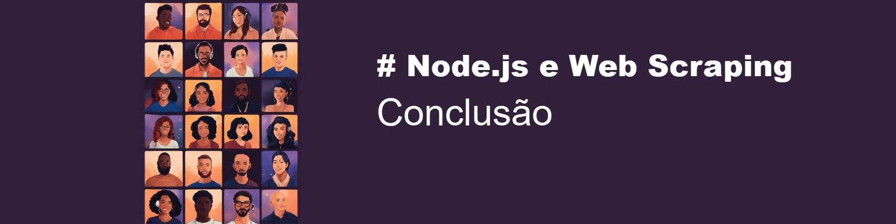

# Introdução

Você já imaginou poder extrair automaticamente informações valiosas de qualquer site na internet? Seja para monitorar preços, coletar dados para pesquisa ou até mesmo para alimentar um projeto pessoal, o Web Scraping pode transformar a web na sua própria base de dados. E com o Node.js, essa tarefa fica mais fácil do que você imagina! Neste artigo, exploraremos como o Node.js e o Web Scraping podem ser suas ferramentas poderosas para automatizar a coleta de dados eficientemente e descomplicada. Vamos nessa?

---


Node.js é uma plataforma que permite rodar JavaScript no servidor, fora do navegador. Ele é rápido e eficiente, perfeito para tarefas que exigem muita entrada e saída de dados. Basicamente, se você sabe um pouco de JavaScript, pode começar a usar Node.js para criar desde sites até ferramentas de automação.

# O que é Web Scraping?

Web Scraping é uma técnica usada para extrair informações públicas de sites. Imagine poder coletar todos os preços de produtos em uma loja online sem precisar anotar um por um, ou armazenar conteúdos de artigos online sem precisar selecionar tudo, copiar e colar. Com Web Scraping, você pode fazer isso automaticamente. É como ter um robô pessoal que navega e coleta dados para você.

# Qual a utilidade do Web Scraping?

O Web Scraping é super útil para muitas coisas! Você pode monitorar preços para encontrar as melhores ofertas, coletar dados para pesquisas acadêmicas, acompanhar tendências de redes sociais, e muito mais. É uma ferramenta poderosa para transformar a web em uma fonte ilimitada de informações que você pode usar para o que quiser.

# Como fazer o Web Scraping?

Para começar com Web Scraping em Node.js, você precisará de algumas bibliotecas como 'axios' para fazer requisições HTTP e 'cheerio' para manipular o HTML. Vejamos um exemplo simples de como coletar dados da Wikipédia:

- Importamos as bibliotecas necessárias

```javascript
const axios = require("axios");
const cheerio = require("cheerio");
```

- Armazenamos a URL da página inicial da Wikipédia

```javascript
const url = "https://pt.wikipedia.org/wiki/Wikip%C3%A9dia:P%C3%A1gina_principal";
```

- Utilizamos o método 'get()' da biblioteca axios para capturar o 'url'
  - Então armazenamos a resposta da 'url' na constante 'html'
    -Carregamos essas informações com o método 'load()' da biblioteca cheerio na variável '$'
    -Inicializamos um objeto vazio na variável 'dados'
    -O conteúdo da página principal da Wikipédia é armazenado em uma tag `<div class="mw-content-ltr..." ...>`
    - Capturamos esse conteúdo e para cada elemento presente em uma 'div' como essa (no caso só existe uma) vamos fazer um tratamento
      - Os cabeçalhos da página inicial estão armazenados em tags `<div class="main-page-block-heading..." ...>`
      - Os conteúdos relacionados com cada cabeçalho estão armazenados em tags `<div class="main-page-block-contents..." ...>`
      - Estabelecemos com 'if()' que, caso a quantidade de cabeçalhos for estritamente igual à quantidade de conteúdos, a função deve prosseguir para
        - Iniciamos um laço de repetição que executará o comando enquanto a condição 'j < cabecalhos.length' for verdadeira
          - Nesse caso, 'cabecalhos.length = 5', então o laço vai executar no intervalo j = [0, 4]
        - Para cada execução do laço
          - Armazenamos em 'dados' na posição 'j' o conteúdo de texto presente nas tags de cabeçalho na variável 'titulo'
          - Armazenamos em 'dados' na posição 'j' o conteúdo de texto presente em tags de conteúdo na variável 'conteudo'
      - Caso a quantidade de cabeçalhos for diferente da quantidade de conteúdos, o programa deve exibir a mensagem de erro.
  - Exibimos no console o conteúdo do objeto 'dados'

```javascript
axios
  .get(url)
  .then((response) => {
    const html = response.data;
    const $ = cheerio.load(html);
    const dados = [];

    $("div.mw-content-ltr").each((i, div) => {
      const cabecalhos = $(div).find("div.main-page-block-heading");
      const conteudos = $(div).find("div.main-page-block-contents");

      if (cabecalhos.length === conteudos.length) {
        for (let j = 0; j < cabecalhos.length; j++) {
          dados[j] = {
            titulo: $(cabecalhos[j]).text(),
            conteudo: $(conteudos[j])
              .text()
              .replace(/\n/g, "|")
              .replace(/\+/g, "")
              .split("|")
              .filter((item) => item.trim() !== ""),
          };
        }
      } else {
        console.error("O número de títulos e conteúdos não corresponde ao índice", i);
      }
    });
    console.log(dados);
  })
  .catch((error) => {
    console.error("Erro ao fazer scraping:", error);
  });
```

Output:

```powershell
dados = [
  {
    titulo: 'Artigo em destaque',
    conteudo: [
      'Otávio da Grã-Bretanha foi um príncipe, o décimo terceiro filho do rei Jorge III e da sua rainha consorte, Carlota de Meclemburgo-Strelitz. Seis meses após a morte do seu irmão mais novo, o príncipe Alfredo, Otávio foi inoculado contra o vírus da varíola. Vários dias depois acabou por ficar doente. A sua morte aos quatro anos devastou os seus pais e, em particular, o seu pai. O rei Jorge III gostava muito dos seus dois filhos mais novos, Alfredo e Otávio, e os seus últimos surtos de loucura envolviam alucinações deles. (Leia mais)',
      'Compartilhe: ',
      'Artigos destacados: 1438 •',
      'Artigos bons: 1867'
    ]
  },
  {
    titulo: 'Eventos atuais',
    conteudo: [
      'Nemo (imagem), representando a Suíça, vence o Festival Eurovisão da Canção com "The Code".',
      'Tempestades solares atingem a Terra, criando auroras polares em latitudes mais baixas que o normal.',
      'Enchentes no estado brasileiro do Rio Grande do Sul causam dezenas de mortes e deixam milhares de desabrigados.',
      "CNSA lança espaçonave Chang'e 6  com objetivo de recuperar amostra no lado oculto da Lua.",
      'Eventos a decorrer: Crise haitiana • Guerra Israel-Hamas (crise do Mar Vermelho) • Invasão da Ucrânia pela Rússia (cronologia)Mortes recentes: Alice Munro',
      'Paulo César Pereio',
      'Amália Barros',
      'Fernando Emílio',
      'James Harris Simons',
      'Roger Corman',
      'Mais eventos atuais • Sugestões Wikinotícias'
    ]
  },
  {
    titulo: '14 de maio na história',
    conteudo: [
      'Vacina contra a varíola',
      'Independência do Paraguai (1811)',
      '1796 — Edward Jenner realiza o primeiro teste da vacina contra a varíola (na imagem).',
      '1948 — Em Tel Aviv, David Ben-Gurion pronuncia a declaração de independência do Estado de Israel.',
      '1952 — O Esquadrão de Demonstração Aérea Brasileiro, conhecido como Esquadrilha da Fumaça, realiza sua primeira exibição oficial.',
      'Nasceram neste dia…',
      'Robert Owen (1771-1858)  •  George Lucas (n. 1944)  •  Cate Blanchett (n. 1969)',
      'Morreram neste dia…',
      'Henrique IV de França (1553-1610)  •  Emma Goldman (1869-1940)  •  Frank Sinatra (1915-1998).',
      'Ver mais • Outros dias: 12 • 13 • 14 • 15 • 16 • Ver todos'
    ]
  },
  {
    titulo: 'Sabia que...',
    conteudo: [
      '… a planta com a maior flor registrada é a Rafflesia arnoldii (imagem), espécie cujas flores podem chegar a um metro de diâmetro e atingir o peso total de 11 quilogramas?',
      '… os nazistas promoveram a esterilização em massa de centenas de crianças afro-alemãs, chamadas de forma racista bastardos da Renânia, num programa oficial de eugenia?',
      '… uma rinoceronte foi quem mais recebeu votos na eleição para a Câmara Municipal de São Paulo, em 1959?',
      '… Dámaso Antonio Larrañaga, naturalista reconhecido e religioso uruguaio, foi membro do primeiro Senado Brasileiro e também do primeiro senado do Uruguai?',
      '… a cúpula do Panteão, em Roma, templo construído aos deuses romanos no início do século II e convertido em igreja na Idade Média, é até os dias de hoje a maior estrutura do tipo feita em concreto não armado?',
      'Índice geral • Sugestões'
    ]
  },
  {
    titulo: 'Imagem do dia',
    conteudo: [
      'Botão de agapanto-branco “White Heaven” (Agapanthus africanus). Técnica do empilhamento de foco (focus stacking) de 39 imagens. São plantas herbáceas, rizomatosas e bastante robustas, endêmicas da África do Sul, que podem ser facilmente reconhecidas pelas suas folhas em forma de fita, planas e bastante carnudas; pela sua inflorescência em umbela na extremidade de um longo escapo e pelas flores geralmente grandes com superovário.',
      '(resolução original: 3 456 × 3 456)',
      'Compartilhe:  ',
      'Índice geral • Commons'
    ]
  }
]
```

---


Com o poder do Node.js e a técnica de Web Scraping, você pode transformar a vastidão da web em uma fonte inesgotável de dados personalizados. Este processo pode parecer complicado no início, mas com as ferramentas e o conhecimento certo e prática de código, você pode automatizar a coleta de dados de maneira eficaz e eficiente. Então, comece hoje mesmo a explorar as possibilidades e veja como o Web Scraping pode ser uma adição valiosa ao seu conjunto de habilidades. Se gostou do conteúdo, não se esqueça de me seguir nas redes sociais!

<a href="https://www.linkedin.com/in/heber-stavrakas-gaipo/" style="margin: 0.4rem 0;"></a>
<a href="https://github.com/Heber-Stavrakas-Gaipo" style="margin: 0.4rem 0;"></a>

---

## Ferramentas de produção:

Imagens geradas por: I.A. lexica.art

Editor de imagem: LibreOffice

Conteúdo base gerado por: ChatGPT 

Revisões e inserções humanas: Heber Gaipo

---
## Tags 🔖
#NodeJS #WebScraping #JavaScript